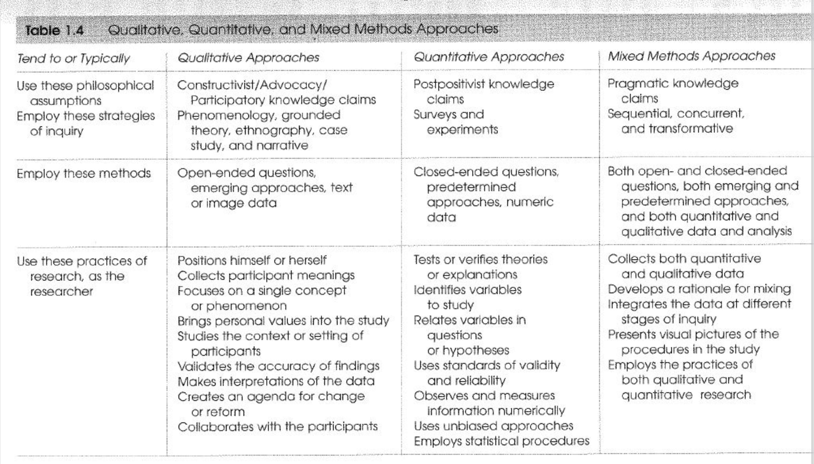
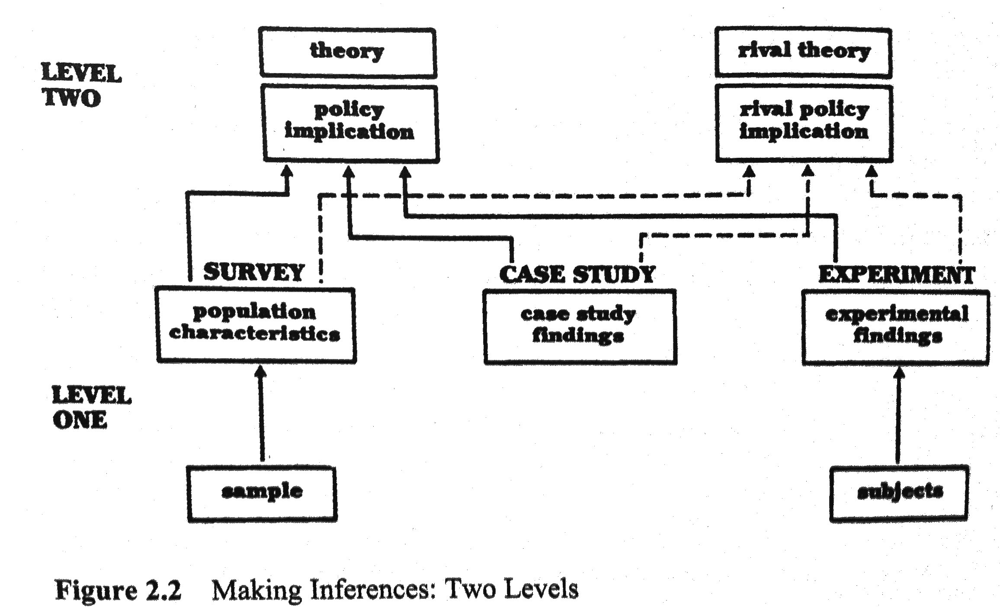

# Qualitative Research Approaches in CS

## Learning Objectives

* Learn about the scope of qualitative research in CS
* Summarize different qualitative research methods
* See some exemplars of excellent qualitative CS papers

## Notes

Q: what haven't we covered yet that you want to cover?

I don't particularly like the qual/quant distinction - I find it more useful to look at research strategies using the ABC or WWH or Circumplex frameworks. 

[Saner slides]

But typically qualitative research refers to research strategies that analyze the evidence *qualitatively*, i.e., interpretively. Data sources that fit well in these strategies are personal narratives, observations of users, interview transcripts, texts like books or videos, open-ended survey answers, etc. 

Qualitative research is more often associated with constructivist and interpretivist philosophies. 

Good qualitative research is **no less valid** than quantitative research.

Yin's case study inference diagram. Focus on units of analysis. 

### Qualitative Methods (established)

* surveys (both qual/quant)
* interviews
* ethnography/participant observation
* contextual inquiry

### Methods (emerging/lesser known in CS)

* Narrative analysis
* Action Research
* Diary studies (like narrative)
* Focus groups
* ... 

### Analysis Approaches

* [grounded theory](https://dl.acm.org/doi/10.1145/2884781.2884833) 
* thematic coding
* Coding from predefined coding categories 

### Validity and qualitative research

A common critique of these methods is "the plural of anecdote is not data". As Yin's diagram shows, though, qualitative research is rarely just anecdote (and we can of course learn from anecdote! Aesop's fables are one example). However, a good question to ask when reading such work is "how do I know this is a true account and legitimate interpretation" of the data?

- Member checking
- Rich descriptions (thick)
- Links to evidence
- Measure reliability 
- Self-critique and journalling

### Coding Data

Qualitative data is increasingly analyzed with tools, e.g., NLP techniques for extracting narrative summaries, micro-narratives that can be quickly grouped into themes. But human interpretation of the data is still really important. It's both incredibly insightful and incredibly boring to do. 

One question we can ask is "given the same data set, would another person find the same code". Note the positivist assumptions here.

We could measure the inter-rater agreement or reliability using common techniques such as Cohen's kappa, and then make an argument as to why that justifies validity of the coding approach.

My view: the real question is how reliable is the coding guide. The best way to validate this is to conduct robust coding agreement sessions and refinement of the coding guide/taxonomoy. 

## Exercise

Let's suppose we have a study planned into how people update SO questions. For example, our working theory might be that the edit comments on SO questions tell us something about how knowledge is curated on SO. So we want to begin looking through the data to see how well that works. 

Visit the [Google sheet here](https://drive.google.com/file/d/1KvQCYx9TJXgHdU5CURsbiijKWM2zhmcP/view?usp=sharing). Make a copy of it or download it.

Spend 5 minutes adding labels to at least 10 rows of the data.

## <!--Exemplar Readings-->

* <!--**Interviews**: *Barwulor, C., McDonald, A., Hargittai, E., & Redmiles, E. M. (2021)“*[Disadvantaged in the American-dominated internet”: Sex, Work, and Technology](https://files.osf.io/v1/resources/vzehu/providers/osfstorage/5f63a97211fb7c000f18f2c7?format=pdf&action=download&direct&version=2)*. In Proceedings of the 2021 ACM SIGCHI Conference on Human Factors in Computing Systems (CHI) (pp. 931-936). [paper](sex_work_tech_use.pdf)-->
* <!--**Ethnography**:--> 

## Optional and Recommended

* Research design: qualitative, quantitative and mixed methods approaches Creswell, John W. Sage, 2018.
* The [links on Dr Storey's course page.](https://github.com/margaretstorey/EmseUvic2020/blob/master/resources/methods.md)

